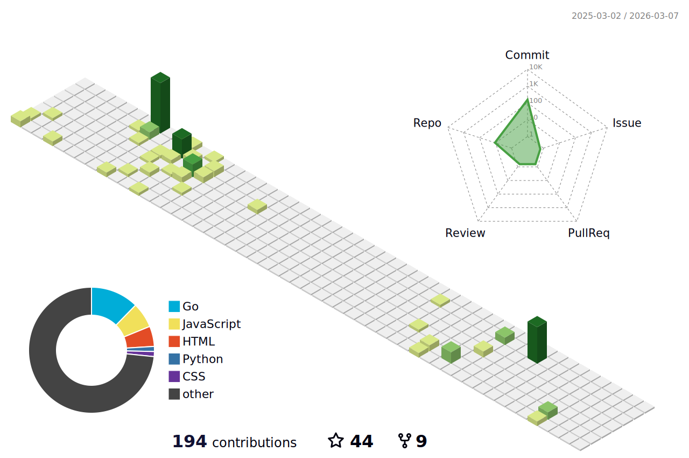

# Royaloak

  

## Professional Overview

### Core Competencies
- Network Security & Protocol Architecture
- Full Stack Development
- Infrastructure Design
- System Architecture
- Educational Technology Development

### Technical Stack

  

## Featured Projects

### Go Projects

  
  
  
  

### Python Projects

  
  
  
  

### JavaScript/ Projects

  
  

### C/C++ Projects

  
  

## Technical Statistics

  
  
  

## Professional Contact

  
  
  

  © 2024 Royaloak. All rights reserved.

