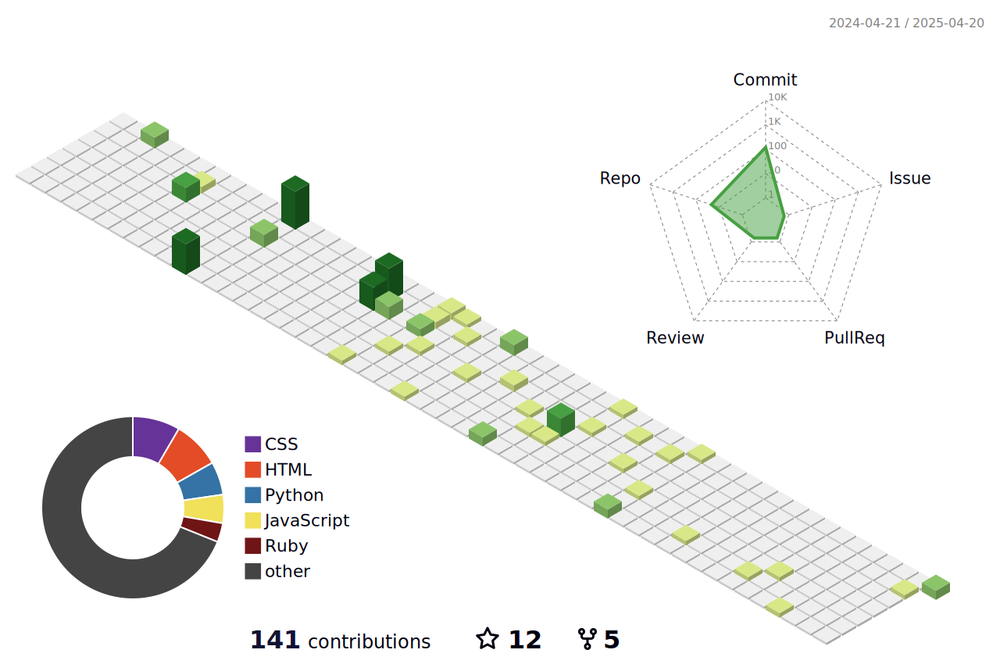

# Royaloak

  

## Professional Overview

  

### Core Competencies
- Network Security & Protocol Architecture
- Full Stack Development
- Infrastructure Design
- System Architecture
- Educational Technology Development

### Technical Stack

  

## Professional Experience

### Network & Security
- Protocol Analysis & Implementation (Layer 4 & 7)
- Network Infrastructure Design
- Security Architecture
- Educational Technology Development

### Development
- Full Stack Development (5+ years)
- Binary Development
- System Architecture
- Infrastructure Management

## Current Projects

### Infrastructure & Security
- Educational Technology Platforms
- Network Protocol Analysis Tools
- System Architecture Solutions
- Infrastructure Management Systems

### Development Focus
- Protocol Implementation
- System Architecture
- Educational Tools
- Infrastructure Solutions

## Technical Statistics

  
  

## Professional Contact

  
  
  

  

  © 2024 Royaloak. All rights reserved.

